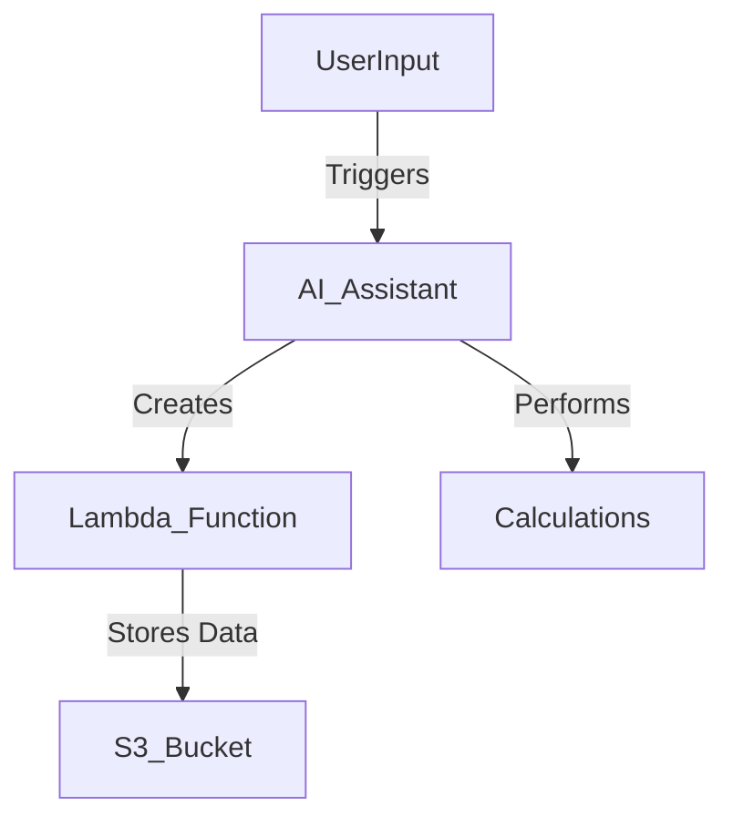

# AI Agent using Python and AWS Bedrock

This repository contains a Python-based AI assistant built using AWS Bedrock. The assistant is designed to automate the creation of AWS Lambda functions based on user inputs and can perform various mathematical calculations.

## Prerequisites

- Python 3.11 or higher
- AWS account with appropriate permissions for Lambda and S3
- AWS CLI configured with your credentials

## Setup

### 1. Install Dependencies

Before you begin, ensure all the required packages are installed by running:

```bash
pip install -r requirements.txt
```

### 2. Configure Environment Variables

Make sure to set up the required environment variables before running the agent. These variables are crucial for connecting to your AWS resources.

```bash
export LAMBDA_ROLE=REPLACE_WITH_LambdaRole
export S3_BUCKET=REPLACE_WITH_DataAnalysisS3Bucket
```

Replace `REPLACE_WITH_LambdaRole` with your actual Lambda role ARN and `REPLACE_WITH_DataAnalysisS3Bucket` with the name of your S3 bucket used for data analysis.

### 3. Running the Agent

To run the agent, execute:

```bash
python agent.py
```

This will start the AI agent and allow it to interact with AWS services as configured.

## Usage

The agent is designed to:

- Collect user inputs for function name, runtime, handler, and other configurations.
- Automatically create and deploy AWS Lambda functions using the provided inputs.
- Perform various mathematical calculations as requested by the user.
- Store related function data in the specified S3 bucket for reference.

Make sure that your AWS Lambda function and S3 bucket are properly configured to match the environment variables.

## Architecture



## License

AWS Amazon
